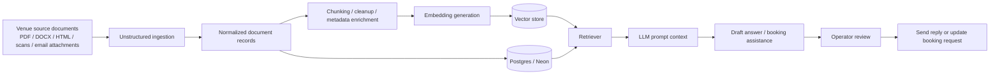
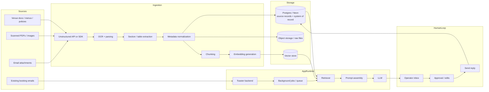
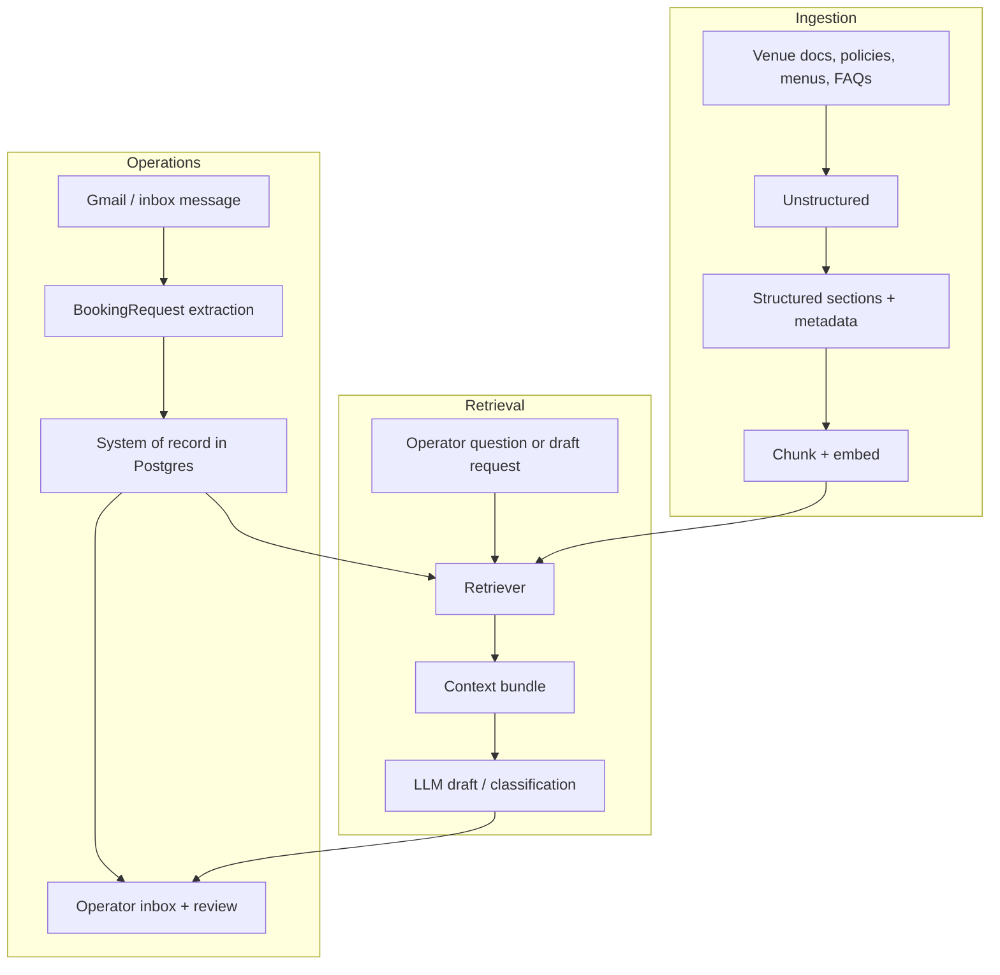

# Toaster RAG Pipeline

This document sketches the proposed document-ingestion and retrieval architecture for Toaster.

## Goal

Turn messy venue source material into structured, retrievable knowledge that can support booking-request handling and operator workflows.

## Recommended ingestion stack

- **Unstructured** for document ingestion and parsing
- **Toaster backend** for orchestration and persistence
- **Postgres/Neon** for normalized records and operational state
- **Vector store** for semantic retrieval
- **LLM layer** for answer generation and drafting

## High-level flow

## Detailed architecture

## Toaster-specific shape

## Why Unstructured fits here

- The client is willing to pay for it, so this is not a cost-constrained decision.
- It reduces time spent building a custom document parsing pipeline.
- It is a better default when source files are inconsistent or ugly.
- It lets Toaster keep the rest of the RAG stack under our control.

## What should stay in Toaster

Keep these parts inside the app instead of outsourcing them:

- chunking policy
- embedding model choice
- retrieval ranking
- prompt assembly
- booking-request state transitions
- operator approval flow

## Design rule

Unstructured should be the **ingestion front end**, not the whole RAG system.

That keeps the architecture simple:

- vendor for document parsing
- app-owned storage and retrieval logic
- app-owned workflow state

## Notes

This diagram is intentionally conceptual. It is meant to guide implementation and issue breakdowns, not to freeze exact table names or service boundaries.
